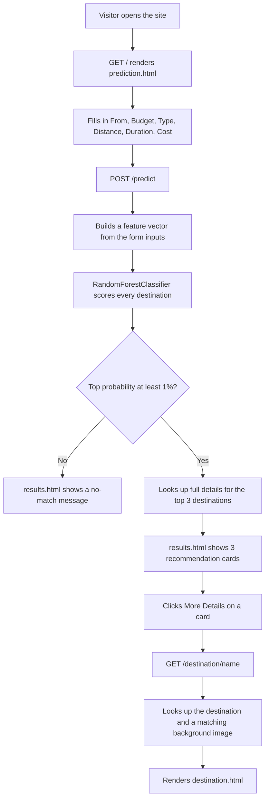
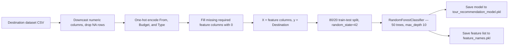

# 🗺️ Tourism Spot Recommender BD

**A Flask web app that recommends Bangladeshi travel destinations using a scikit-learn model trained on trip preferences — starting city, budget, distance, duration, and type of place.**


ffmpeg -i TourRecomBD.1.1.mp4 -vf "cropdetect=24:16:0" -f null - 2>&1 | grep crop
https://github.com/user-attachments/assets/efc0e5f6-3d72-4aa1-9283-bd31d7583690

## Table of Contents
- [Overview](#overview)
- [Features](#features)
- [Demo](#demo)
- [How It Works](#how-it-works)
- [The Recommendation Model](#the-recommendation-model)
- [Dataset](#dataset)
- [Tech Stack](#tech-stack)
- [Getting Started](#getting-started)
- [Usage](#usage)
- [Routes Reference](#routes-reference)

## Overview

Tourism Spot Recommender BD pairs a small Flask app with a `RandomForestClassifier` trained on a custom dataset of Bangladeshi tourist destinations. A visitor picks a starting city, a budget tier, a type of place, and a target distance/duration/cost; the model scores every destination in the dataset and returns the top 3 matches, each with an estimated single-traveler and couple cost. From there, visitors can open a dedicated detail page for any recommended spot.

## Features

- 🧭 **Simple preference form** — starting city, budget tier, destination type, target distance, trip length, and budget in BDT
- 🤖 **ML-powered matching** — a `RandomForestClassifier` scores every destination in the dataset and returns your top 3 matches
- 💰 **Single & couple cost estimates** — every recommendation shows both a single-traveler cost and an estimated couple cost
- 📍 **Destination detail pages** — drill into any recommended spot for a page with a background image matched to its type
- 🚫 **Graceful no-match handling** — if nothing scores above a 1% confidence threshold, the app says so instead of forcing a bad recommendation
- 🎨 **Animated frontend** — a rotating image slideshow behind the preference form and a looping video background on the results page

## Demo

| Trip Preference Form | Recommended Destinations |
|---|---|
|  |  |

*Add your exported screenshots at those paths — the ones above match the "Plan Your Next Tour" form and "Top Recommended Destinations" results page from your project.*

A real run against the model returned three Hills destinations near Bandarban and Panchagarh — Darjeeling Point, Boga Lake, and Keokradong — each with a single and couple cost estimate.

## How It Works



## The Recommendation Model

`train_model.py` builds the model that `app.py` loads at startup:



**Features fed to the model:**

| Type | Fields |
|---|---|
| Numeric | `Distance (km)`, `Duration (Days)`, `Cost (BDT)` |
| Categorical (one-hot) | `From` (origin city), `Budget` (Low / Medium / High), `Type` (Sea Beach, Historical Palace, Park, Picnic Spot, Forest, Island, Hills) |
| Target | `Destination` — the exact name of a specific tourist spot |

Because the target is the literal destination name rather than a category, the model can only recommend places that were in the training data. Adding new rows to the CSV means re-running `python train_model.py` before they'll show up as recommendations.

## Dataset

`app.py` and `train_model.py` both expect this file at the project root:

```
Endgame_tour_dataset_ultimate_final_Pro_Max.csv
```

| Column | Description |
|---|---|
| `From` | Origin city |
| `Destination` | Name of the tourist spot (also the model's target label) |
| `City` | City/district where the destination is located |
| `Type` | Sea Beach, Historical Palace, Park, Picnic Spot, Forest, Island, or Hills |
| `Distance (km)` | Distance from the origin city |
| `Duration (Days)` | Suggested trip length |
| `Budget` | Low, Medium, or High |
| `Cost (BDT)` | Estimated cost in Bangladeshi Taka — used as the "single cost" in the app |

Sample rows:

| From | Destination | City | Type | Distance (km) | Duration (Days) | Budget | Cost (BDT) |
|---|---|---|---|---|---|---|---|
| Chittagong | Kuakata Beach | Patuakhali | Sea Beach | 345 | 3 | Medium | 18808 |
| Dhaka | Bangladesh National Meusium (sic) | Dhaka | Historical Palace | 12 | 1 | Low | 1201 |
| Cumilla | Shibganj Mango Orchard | Chapainawabganj | Picnic Spot | 687 | 1 | Medium | 2246 |
| Sylhet | Tilagor Eco Park | Sylhet | Park | 8 | 1 | Low | 360 |
| Dhaka | Ratargul Swamp Forest | Sylhet | Forest | 257 | 2 | Medium | 2747 |
| Barisal | Fatra's Char | Patuakhali | Island | 113 | 1 | Medium | 9186 |
| Cumilla | Nilachal | Bandarban | Hills | 220 | 3 | High | 6312 |

*(sic) marks a spelling exactly as it appears in the source spreadsheet.*

The **couple cost** shown in the app isn't a dataset column — both `/predict` and `/destination/<name>` compute it on the fly as `round(single_cost * 1.85)`.

Budget tiers, as defined on the form: **Low** = 0–2,000 BDT, **Medium** = 2,001–6,000 BDT, **High** = above 6,000 BDT.

## Tech Stack

| Layer | Technology | Purpose |
|---|---|---|
| Backend | Python, Flask | Routing, form handling, serving pages |
| Machine learning | scikit-learn (`RandomForestClassifier`) | Destination recommendation model |
| Data handling | pandas, numpy | Loading and preprocessing the dataset |
| Model persistence | joblib | Saving/loading the trained model and feature list |
| Frontend | HTML5, CSS3, Jinja2 | Form, results, and destination detail pages |
| Fonts | Google Fonts (Roboto) | Typography on the preference form |

> **About `style.css`:** its selectors (`#banner`, `#intro`, `#description`, `#contact`, `.content-fit`) don't appear in `prediction.html`, `results.html`, or `destination.html` — each of those defines its own styles inline instead. This looks like it belongs to a different page (maybe an About/portfolio section) that wasn't in what you shared. Let me know if it should link somewhere, or if it's safe to leave as-is.

## Getting Started

### Prerequisites
- Python 3.8+
- pip
- Git

### 1. Clone the repository
```bash
git clone https://github.com/<your-username>/Tourism-spot-recommender-BD.git
cd Tourism-spot-recommender-BD
```

### 2. Create a virtual environment
```bash
python -m venv venv
source venv/bin/activate      # Windows: venv\Scripts\activate
```

### 3. Install dependencies
No `requirements.txt` was in what you shared, so here's one built from the imports in `app.py` and `train_model.py` — swap in your actual pinned versions if you have them:
```bash
pip install flask pandas numpy scikit-learn joblib
```

### 4. Add the dataset
Place `Endgame_tour_dataset_ultimate_final_Pro_Max.csv` in the project root.

### 5. Train the model
```bash
python train_model.py
```
This generates `tour_recommendation_model.pkl` and `feature_names.pkl`, which `app.py` loads on startup.

### 6. Run the app
```bash
python app.py
```
The app runs in debug mode on `0.0.0.0:5000`, so it's reachable at `http://localhost:5000` or your machine's LAN address (e.g. `http://192.168.x.x:5000`, matching the screenshots above).

### 7. Open it
Visit `http://localhost:5000` and fill out the form.

## Usage

1. Open the home page and pick your starting city, budget tier, and destination type, then enter a target distance, duration, and cost.
2. Submit the form — the model scores every destination and returns your top 3 matches.
3. Each result card shows the destination's city, type, distance, and an estimated single/couple cost.
4. If nothing scores above the confidence threshold, you'll see a no-match message instead of a low-quality guess.
5. Click **More Details** on any card for a full page on that destination.

## Routes Reference

| Route | Method | Renders | Description |
|---|---|---|---|
| `/` | GET | `prediction.html` | Trip preference form |
| `/predict` | POST | `results.html` | Scores the submitted preferences and shows the top 3 matches, or a no-match message |
| `/destination/<name>` | GET | `destination.html` | Full detail view for one destination, looked up by exact name |
